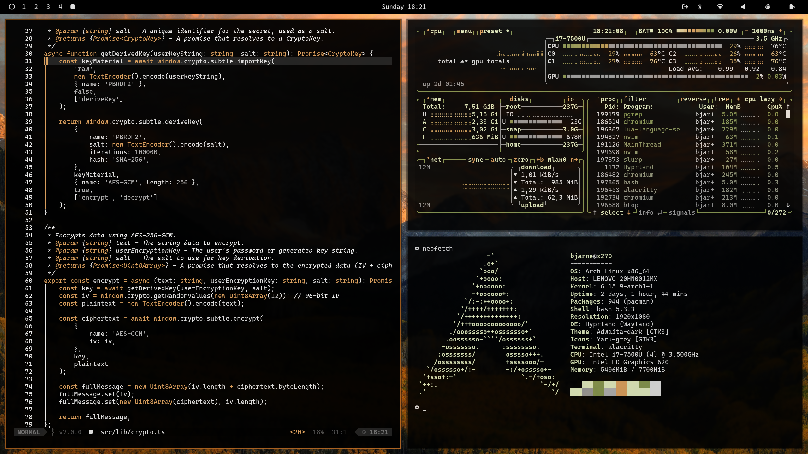

# Omarchy Wood Theme

This is the Wood Theme for [Omarchy.org](https://omarchy.org), providing a cohesive and visually appealing configuration set for your Linux desktop environment.

<p align="center">
  
</p>

>A whisper soft, a final sigh,  
>Of embers fading, where flames danced high.  
>A silver ghost on the hearthstone laid,  
>A memory of the fire's parade.  
>This is the ash, the soft and grey,  
>The quiet end of a burning day.  

## Installation

To install this theme, simply use the `omarchy-theme-install` command:

```bash
omarchy-theme-install https://github.com/bjarneo/omarchy-wood-theme
```

## Neovim theme
[https://github.com/bjarneo/wood.nvim](https://github.com/bjarneo/wood.nvim)

## X.com
[iamdothash](https://x.com/iamdothash)
